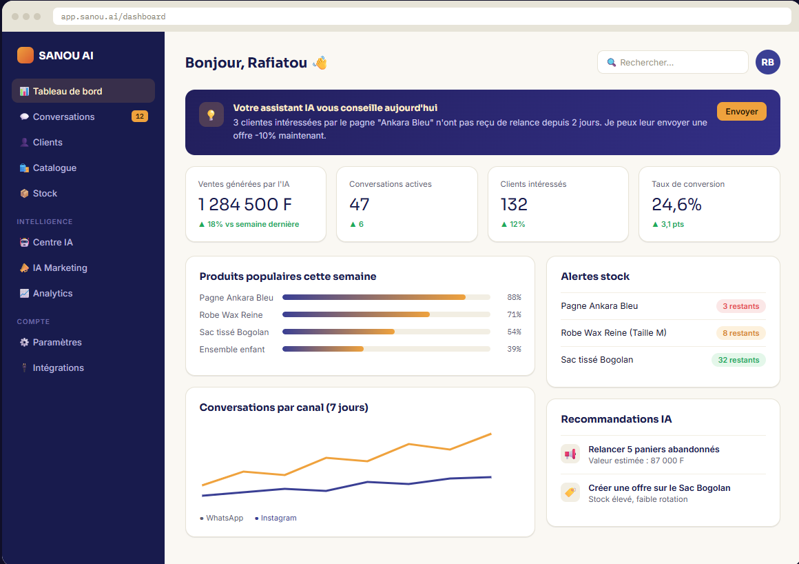
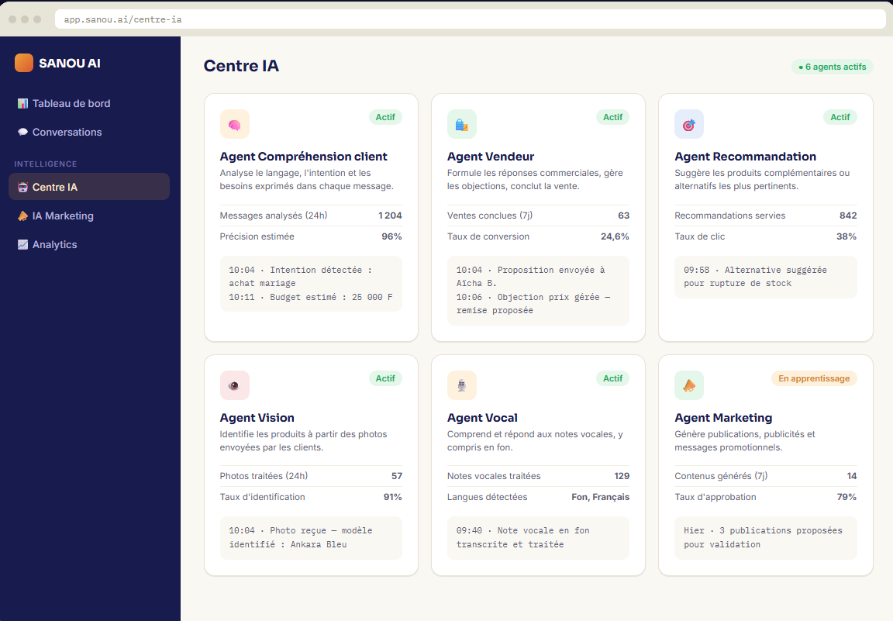
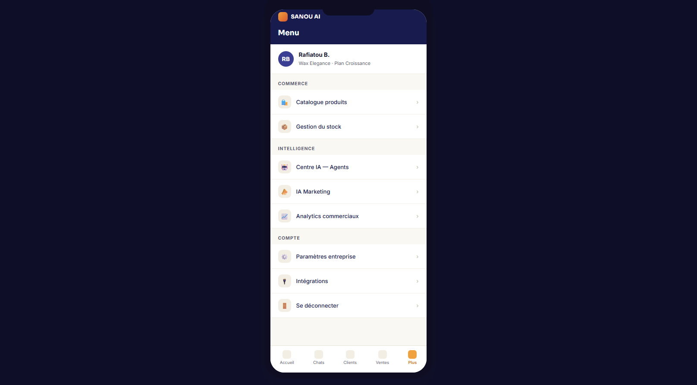
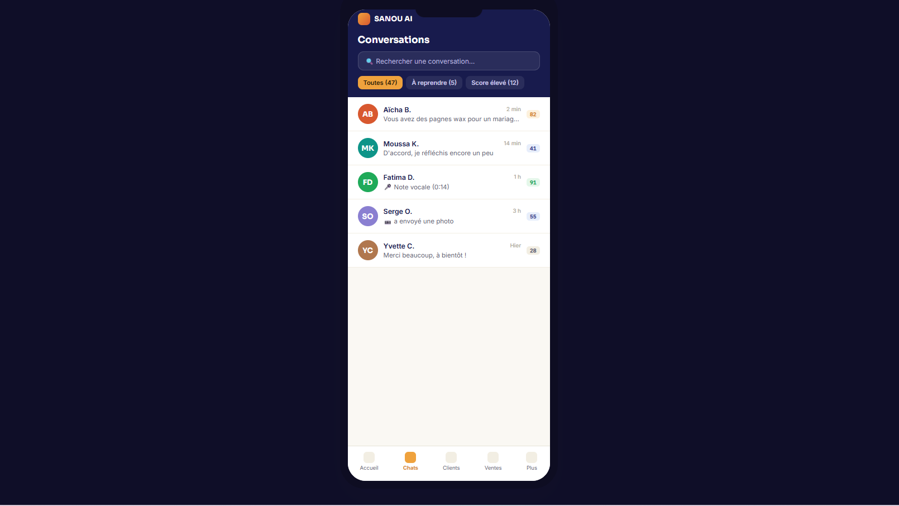

# 🚀 SANOU AI — Plateforme SaaS d'Intelligence Commerciale Autonome

> **"SANOU"** signifie *"Vendre"* en langue Fon.

SANOU AI est un employé commercial virtuel propulsé par l'IA, conçu pour aider les commerçants, e-commerçants et PME à automatiser leurs ventes, analyser les besoins de leurs clients et augmenter leurs revenus sur tous leurs canaux (WhatsApp, Instagram, Facebook, Web).

---

## 🎯 Démo en ligne

👉 **Consulter la démo interactive :** [https://votre-projet.vercel.app](https://votre-projet.vercel.app)

---

## ✨ Fonctionnalités Principales

* 💬 **Inbox Multi-Canaux Unifiée :** Centralisation des conversations WhatsApp, Instagram et Facebook.
* 🧠 **Agents IA Autonomes :** 
  * **Agent Vendeur :** Répond aux questions, gère les objections et conclut les ventes 24/7.
  * **Agent Vision :** Identifie automatiquement un produit dans le catalogue à partir d'une simple photo envoyée par le client.
  * **Agent Vocal :** Traite et comprend les notes vocales (Français, langues locales).
* 📊 **Tableau de Bord & Analytics :** Suivi en temps réel des ventes IA, des taux de conversion et des performances produits.
* 📦 **Gestion de Stock Intelligent :** Prédictions de rupture de stock et recommandations de réapprovisionnement.
* 🤝 **Mode Hybride (Human-in-the-Loop) :** Passation fluide de la main à un vendeur humain pour les cas complexes ou les négociations spécifiques.

---

## 🛠️ Stack Technique

* **Frontend :** HTML5, Tailwind CSS, JavaScript (ES6+)
* **Interface UX/UI :** Design System personnalisé (Inspiré de Shopify, Stripe & Notion)
* **Déploiement :** Vercel / Netlify

---

## 📱 Aperçu des Écrans Principaux

| Écran | Description |
| :--- | :--- |
| **Dashboard** | Vue d'ensemble des KPIs, ventes générées par l'IA et alertes stock. |
| **Centre de Conversation** | Fil de discussion avec suggestions IA et score d'achat client. |
| **Catalogue & Produits** | Fiches produits enrichies avec prédictions et analyse IA. |
| **Centre d'Agents IA** | Panneau de contrôle du comportement et du ton des agents commerciaux. |

---

## 📂 Structure du Projet

├── index.html          # Application principale (SPA)
├── assets/
│   ├── css/            # Styles et configuration Tailwind
│   ├── js/             # Logique d'interaction et simulation IA
│   └── images/         # Logos et assets visuels
└── README.md           # Documentation du projet
## 📸 Aperçu de l'Interface

### 🖥️ Interface Desktop

| Tableau de bord (Dashboard) | 
| :---: | 
|  |
| *Vue d'ensemble des ventes et recommandations IA* | 

| Catalogue Produit Intelligent | 
| :---: |
|  | 
| *Gestion des stocks et analyse des performances* | 

---

### 📱 App Mobile Vendeur

  
  &nbsp;&nbsp;&nbsp;&nbsp;
  

  <i>Interface mobile optimisée pour les vendeurs sur le terrain et la réactivité WhatsApp.</i>

